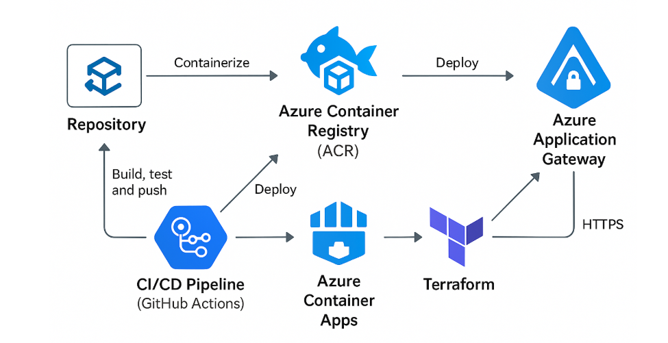
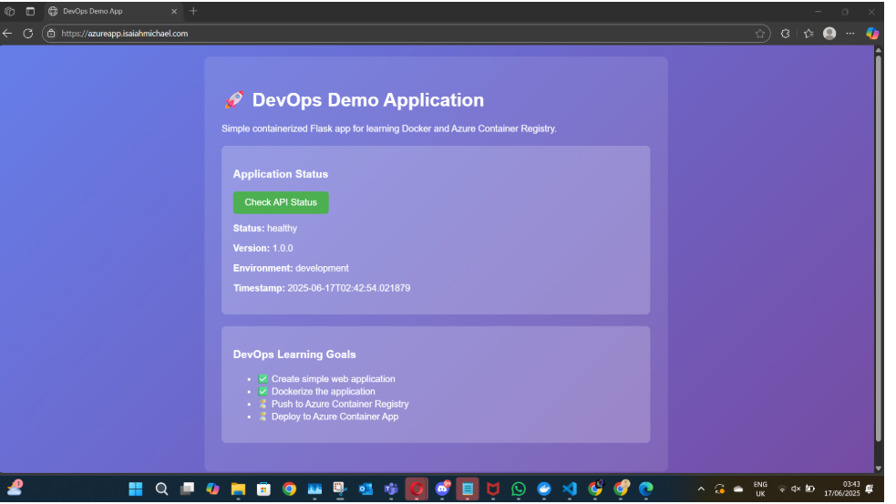

# 🚀 DevOps Demo Application

A simple containerized Flask web application demonstrating DevOps practices with Docker, Azure Container Registry (ACR), Azure Container Apps, and Application Gateway with HTTPS.

## 📋 Project Overview

This project showcases a complete DevOps pipeline from development to production deployment on Azure, featuring:

- **Simple Flask Web Application** with a beautiful UI
- **Docker Containerization** for consistent deployment
- **Azure Container Registry** for secure image storage
- **Azure Container Apps** for scalable container hosting
- **Application Gateway** with SSL/TLS for secure HTTPS access
- **Infrastructure as Code** using Terraform

## 🏗️ Architecture



The application follows a modern containerized architecture:
1. **Repository** - Source code stored in Git
2. **CI/CD Pipeline** - GitHub Actions for automated build, test, and deployment
3. **Azure Container Registry** - Secure Docker image storage
4. **Azure Container Apps** - Managed container hosting platform
5. **Application Gateway** - Load balancer with SSL termination and HTTPS
6. **Terraform** - Infrastructure provisioning and management

## 🌟 Features

### Application Features
- **Responsive Web UI** with modern design
- **Health Check API** endpoint for monitoring
- **Real-time Status Information** including version, environment, and timestamp
- **SSL/HTTPS Security** with valid certificate

### DevOps Features
- **Containerized Deployment** using Docker
- **Infrastructure as Code** with Terraform
- **Automated CI/CD** pipeline ready
- **Secure Image Registry** integration
- **Production-ready** HTTPS configuration

## 🖥️ Application Screenshots

### Home Screen


The application features a clean, modern interface with:
- Welcome message and project description
- Interactive status check functionality
- DevOps learning goals tracker
- Responsive design with gradient background

### API Status Check


Click "Check API Status" to see:
- Application health status
- Current version information
- Environment details
- Real-time timestamp

### HTTPS Security


The application is secured with:
- Valid SSL/TLS certificate
- HTTPS-only access
- Secure connection indicators in browser
- Production-ready security configuration

## 🚀 Quick Start

### Prerequisites
- Docker installed
- Azure CLI configured
- Terraform installed
- Azure subscription with appropriate permissions

### Local Development
```bash
# Clone the repository
git clone <your-repo-url>
cd AzureContainerApp

# Create virtual environment
cd app
python3 -m venv venv
source venv/bin/activate

# Install dependencies
pip install -r requirements.txt

# Run locally
python3 app.py
```

Visit `http://localhost:5000` to see the application.

### Docker Build & Test
```bash
# Build Docker image
cd app
docker build -t devops-demo-app .

# Run container locally
docker run -p 5000:5000 devops-demo-app
```

### Deploy to Azure

1. **Configure ACR credentials**:
```bash
# Get ACR credentials
az acr credential show --name <your-acr-name>
```

2. **Push to Azure Container Registry**:
```bash
# Login to ACR
az acr login --name <your-acr-name>

# Tag and push image
docker tag devops-demo-app <your-acr>.azurecr.io/devops-demo-app:latest
docker push <your-acr>.azurecr.io/devops-demo-app:latest
```

3. **Deploy infrastructure**:
```bash
cd terraform
terraform init
terraform plan
terraform apply
```

## 📁 Project Structure

```
AzureContainerApp/
├── app/
│   ├── app.py                 # Flask application
│   ├── requirements.txt       # Python dependencies
│   ├── Dockerfile            # Container configuration
│   ├── .dockerignore         # Docker ignore rules
│   └── templates/
│       └── index.html        # Web UI template
├── terraform/
│   ├── main.tf               # Infrastructure definition
│   ├── variables.tf          # Terraform variables
│   ├── terraform.tfvars      # Variable values
│   ├── outputs.tf            # Output definitions
│   └── provider.tf           # Azure provider config
├── .github/
│   └── workflows/
│       └── deploy.yml        # CI/CD pipeline
├── visuals/
│   ├── architecture-diagram.png
│   ├── home-screen.png
│   ├── api-status.png
│   └── https-security.png
└── README.md                 # This file
```

## 🔧 Configuration

### Environment Variables
- `ENVIRONMENT`: Application environment (development/production)
- `ACR_LOGIN_SERVER`: Azure Container Registry URL
- `ACR_USERNAME`: Registry username
- `ACR_PASSWORD`: Registry password (store as secret)

### Terraform Variables
Configure in `terraform/terraform.tfvars`:
```hcl
acr_username     = "your-acr-username"
acr_password     = "your-acr-password"
acr_login_server = "your-acr.azurecr.io"
ssl_cert_password = "your-cert-password"
```

## 🛡️ Security

- **HTTPS Only**: All traffic encrypted with SSL/TLS
- **Secure Headers**: Security headers implemented
- **Container Security**: Non-root user in Docker container
- **Secret Management**: Sensitive data stored in Azure Key Vault/GitHub Secrets
- **Network Security**: Application Gateway provides additional security layer

## 📊 Monitoring & Health Checks

### Health Endpoints
- `GET /` - Main application interface
- `GET /api/status` - JSON health check endpoint
- `GET /health` - Simple health probe

### Monitoring Features
- Application status tracking
- Real-time health information
- Environment and version reporting
- Timestamp tracking for debugging

## 🎯 DevOps Learning Goals

This project demonstrates:

- ✅ **Create simple web application** - Flask with modern UI
- ✅ **Dockerize the application** - Multi-stage Docker build
- ✅ **Push to Azure Container Registry** - Secure image storage
- ✅ **Deploy to Azure Container App** - Scalable container platform
- ✅ **HTTPS with Application Gateway** - Production security
- ✅ **Infrastructure as Code** - Terraform automation
- 🔄 **CI/CD Pipeline** - GitHub Actions integration (ready)

## 🤝 Contributing

1. Fork the repository
2. Create a feature branch
3. Make your changes
4. Test thoroughly
5. Submit a pull request

## 📝 License

This project is open source and available under the [MIT License](LICENSE).

## 🙋‍♂️ Support

For questions or issues:
- Create an issue in this repository
- Check the troubleshooting section in docs
- Review Azure Container Apps documentation

---

**Built with ❤️ for DevOps learning and demonstration**